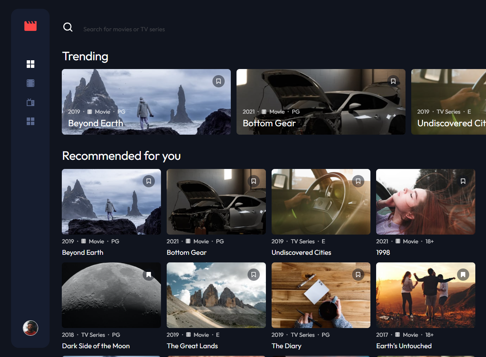

# Frontend Mentor - Entertainment web app solution

This is a solution to the [Entertainment web app challenge on Frontend Mentor](https://www.frontendmentor.io/challenges/entertainment-web-app-J-UhgAW1X). Frontend Mentor challenges help you improve your coding skills by building realistic project.

## Table of contents

- [The challenge](#the-challenge)
- [Screenshot](#screenshot)
- [Links](#links)
  - [Built with](#built-with)
- [Getting started](#getting-started)
- [Enviroment Variables](#enviroment-variables)
- [Author](#author)
- [Acknowledgments](#acknowledgments)

### The challenge

Users should be able to:

- View the optimal layout for the app depending on their device's screen size
- See hover states for all interactive elements on the page
- Navigate between Home, Movies, TV Series, and Bookmarked Shows pages
- Add/Remove bookmarks from all movies and TV series
- Search for relevant shows on all pages
- **Bonus**: Build this project as a full-stack application
- **Bonus**: If you're building a full-stack app, we provide authentication screen (sign-up/login) designs if you'd like to create an auth flow

### Screenshot

### Links

- Solution URL: [https://github.com/patsy005/entertaiment-web-app](https://github.com/patsy005/entertaiment-web-app)
- Live Site URL: [https://entertaiment-web-app-beta.vercel.app/](https://entertaiment-web-app-beta.vercel.app/)

### Built with

- Semantic HTML5 markup
- SCSS and Bootstrap for styling
- Flexbox
- Mobile-first workflow
- React
- Redux
- React Router
- TypeScript
- Fetch API
- Node.js
- Express
- JWT (JSON Web Tokens)
- Bcrypt
- CORS
- dotenv
- Vercel
- Render

### Getting started

1. Clone the repository
2. Run npm install
3. Add .env file
4. Run the server with npm start

### Enviroment Variables

The following variables are required in the `.env` file:

- `JWT_SECRET`: Secret key used for signing JSON Web Tokens.
- `JWT_EXPIRES_IN`: Duration for which the JWT is valid (e.g., `1h`, `2d`).
- `PORT`: Port number for the local server

## Author

- Website - [Patrycja Zawadzka](https://www.linkedin.com/in/patrycja-zawadzka-786836217/)
- Frontend Mentor - [@patsy005](https://www.frontendmentor.io/profile/patsy005)
